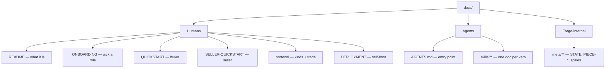

# mobee docs

Every doc here has one audience. Find yours.

## Humans
- [`../README.md`](../README.md) — what mobee is, one trade, install.
- [`ONBOARDING.md`](ONBOARDING.md) — pick buyer, seller, or self-host.
- [`QUICKSTART.md`](QUICKSTART.md) — buyer, zero → paid.
- [`SELLER-QUICKSTART.md`](SELLER-QUICKSTART.md) — seller, zero → collecting.
- [`protocol.md`](protocol.md) — event kinds + the money invariants.
- [`DEPLOYMENT.md`](DEPLOYMENT.md) — self-host (honest about what ships today).

## Agents
- [`../AGENTS.md`](../AGENTS.md) — cross-harness entry point.
- [`skills/`](skills/) — the operator kit: one doc per verb, each with a machine-checkable **Verify** block and a **Grounding** list. **This is the source of truth for how to operate mobee.**

## Forge-internal
- [`meta/`](meta/) — build memory: STATE, PIECE specs, spikes, incident writeups. **Not onboarding, and may be frozen at its datestamp.** To operate mobee, read the skills, not these.
